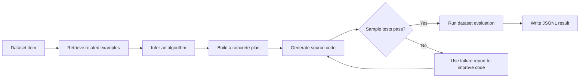

# CodeAtlas

CodeAtlas is a modular framework for evaluating large language models on program synthesis and competitive programming tasks. It combines several prompting strategies with multiple model providers, runs generated programs against dataset tests, and stores every completion and evaluation outcome as JSONL.

## What It Does

- Generates solutions for HumanEval, MBPP, APPS, CodeContest, and xCodeEval tasks.
- Supports Python 3 plus C, C#, C++, Go, PHP, Ruby, and Rust generation.
- Compares direct generation, chain-of-thought, self-planning, and analogical prompting with a multi-stage reasoning strategy.
- Validates generated code against sample tests and functional or I/O-based test suites.
- Resumes from existing output files instead of discarding completed items.
- Preserves prompts, responses, generated source, token counts, retry counts, and solved status for later analysis.

## How It Works



  ### Four-Agent Workflow

  The system organizes the solution process around four cooperating agents:

  1. **Retrieval agent**: finds relevant problems, examples, and algorithmic patterns from the prompting context.
  2. **Planning agent**: turns the problem and retrieved examples into a concrete solution plan, then verifies and ranks candidate plans.
  3. **Coding agent**: converts the strongest plan into code in the requested programming language.
  4. **Debugging agent**: runs sample tests, reads failure reports, and revises the plan or code until the sample cases pass or the retry budget is exhausted.

  The agents are implemented as stages of the prompting strategy and share the same model interface. This keeps the responsibilities distinct while allowing the model provider, dataset, and target language to change independently.

For the default multi-stage strategy, each problem goes through these stages:

1. Retrieve related problems and worked examples.
2. Identify the likely algorithm and summarize the relevant technique.
3. Produce candidate solution plans using the retrieved examples.
4. Verify and rank the plans by confidence.
5. Generate code from the strongest plan.
6. Test it on sample inputs and ask the model to repair failures when needed.
7. Evaluate the final completion and save the result.

The strategy and model layers are separate, so new providers, datasets, and prompting approaches can be added through the existing factories.

## Results

The repository includes precomputed JSONL result artifacts under [`final-results/`](final-results/). The following figures were calculated from two stored HumanEval runs, with `pass_at_k=1`, Python 3 generation, temperature `0`, and 164 tasks:

| Model | Solved | Accuracy |
| --- | ---: | ---: |
| ChatGPT | 132 / 164 | 80.49% |
| GPT-4 Turbo | 154 / 164 | 93.90% |

### Method Comparison

The following comparison uses the stored GPT-4 HumanEval artifacts under the same evaluation settings. Direct prompting is the primary baseline because it sends the problem to the model without the additional retrieval, planning, verification, or repair stages. `Improvement` is measured against Direct.

| Method | Solved | Accuracy | Improvement over Direct |
| --- | ---: | ---: | ---: |
| **Direct prompting** | **141 / 164** | **85.98%** | **Baseline** |
| Analogical | 109 / 164 | 66.46% | -32 tasks (-19.51 pp) |
| Chain-of-thought | 146 / 164 | 89.02% | +5 tasks (+3.05 pp) |
| Self-planning | 140 / 164 | 85.37% | -1 task (-0.61 pp) |
| Reflexion (iterative comparator) | 150 / 164 | 91.46% | +9 tasks (+5.49 pp) |
| **Proposed multi-stage method** | **154 / 164** | **93.90%** | **+13 tasks (+7.92 pp)** |

Against the direct baseline, the proposed method solves 13 more tasks and increases accuracy by 7.92 percentage points. Reflexion remains useful as a secondary iterative comparator: the proposed method solves 4 more tasks than Reflexion (+2.44 percentage points).

The JSONL artifacts include prompts, model responses, generated source code, retry counts, and `is_solved` outcomes. This README summarizes the observable reasoning stages described above rather than reproducing private verbatim chain-of-thought.

These are recorded artifact results, not a claim about a newly executed benchmark. Exact outcomes can vary with provider model versions, API behavior, and dataset revisions.

### CodeContest Results

CodeContest results are also available in the stored artifacts. These runs use Python 3, temperature `0`, `pass_at_k=1`, and the same 165-problem test set for each provider. The proposed multi-stage method is compared with direct prompting under matching provider settings.

| Provider | Direct prompting | Proposed multi-stage method | Relative improvement |
| --- | ---: | ---: | ---: |
| ChatGPT | 9 / 165 (5.45%) | 21 / 165 (12.73%) | +133.33% |
| Gemini | 6 / 165 (3.64%) | 8 / 165 (4.85%) | +33.33% |

Relative improvement is calculated as `(proposed - direct) / direct * 100`. CodeContest evaluates standard-input and standard-output programs against the dataset's test cases, so these results measure end-to-end executable correctness rather than text similarity.

## Project Layout

```text
src/
  main.py                 Command-line entry point
  datasets/               Dataset loaders and dataset-specific evaluators
  models/                 OpenAI (incl. Azure), Gemini, Claude, and Nvidia adapters
  promptings/             Prompting strategies and the strategy factory
  evaluations/            Functional, I/O, and remote execution helpers
  results/                JSONL result persistence
  constants/              Dataset paths and language mappings
  utils/                  JSONL I/O, response parsing, and token counting helpers
data/                     Benchmark inputs and test metadata
final-results/             Precomputed evaluation artifacts
outputs/                  Results created by local runs
```

## Installation

Python 3.11 is recommended.

```bash
git clone <your-repository-url>
cd <your-repository-directory>
python3.11 -m venv .venv
source .venv/bin/activate
python -m pip install --upgrade pip
python -m pip install -r requirements.txt
```

## API Configuration

Copy one of the provider templates to `.env` and fill in only the credentials needed for the model you plan to use:

```bash
cp .env.example.openai .env
```

For OpenAI-compatible runs (`--model ChatGPT` or `GPT4`), configure `API_TYPE`, `OPENAI_API_KEY`, and `OPENAI_MODEL`. For Azure OpenAI, configure `API_TYPE=azure`, `AZURE_API_VERSION`, `AZURE_API_URL`, `AZURE_API_KEY`, and `AZURE_ENGINE_NAME`. Gemini (`--model Gemini`) uses `Google_API_KEY`. Claude (`--model Claude`) uses `ANTHROPIC_API_KEY` and optionally `ANTHROPIC_MODEL`. Nvidia NIM (`--model Nvidia`) uses `NVIDIA_API_KEY` and optionally `NVIDIA_MODEL`. There is no `.env.example` template for the Claude or Nvidia providers yet; set their variables directly in `.env`.

Keep `.env` out of version control. Never commit API keys or generated private credentials.

## Running a Generation Job

Run from the repository root so relative dataset and evaluator paths resolve correctly:

```bash
python src/main.py --dataset HumanEval --model ChatGPT --language Python3 --limit 2
```

The command writes results to `outputs/` and creates a filename from the selected model, strategy, dataset, language, temperature, and `pass_at_k` value.

Useful options:

```text
--dataset       HumanEval, MBPP, APPS, xCodeEval, or CC
--model         ChatGPT, GPT4, Gemini, Claude, or Nvidia
--strategy      Direct, CoT, SelfPlanning, Analogical, or MapCoder (default)
--language      C, C#, C++, Go, PHP, Python3, Ruby, or Rust
--temperature   Sampling temperature; defaults to 0
--pass_at_k     Number of candidate attempts; defaults to 1
--limit         Process only the first N items for a smoke test
```

Omitting `--strategy` selects `MapCoder`, the repository's default multi-stage strategy. A small `--limit` is recommended before launching a full API-backed run.

## Evaluation

Dataset adapters choose the appropriate evaluator:

- **HumanEval and MBPP** run in-process functional correctness checks against the dataset's sample and hidden tests (`evaluations/func_evaluate.py`).
- **APPS, CodeContest, and xCodeEval** are I/O-based: generated programs are executed against stdin/stdout test cases through a remote execution service (`evaluations/evalute.py` and `evaluations/api_comm.py`), with per-language resource limits from `evaluations/limits_by_lang.yaml`.

For EvalPlus-style HumanEval evaluation, the repository includes [`run-evalplus.sh`](run-evalplus.sh). Review and update the input path in that script for your checkout before running the Docker command, since the checked-in example contains a machine-specific path.

## Known Limitations

- The `xCodeEval` option is exposed by the CLI, while the current dataset factory uses the internal name `XCode`; align those names before running that dataset.
- The EvalPlus helper contains a machine-specific input path and needs to be edited for a new checkout.
- Provider APIs and the remote execution service are external dependencies and may change independently of this repository.

Generated code executes as part of evaluation. Use isolated environments, resource limits, and datasets you trust when evaluating untrusted model output.

## Reproducibility Notes

- Set temperature to `0` for the most repeatable provider behavior.
- Record the provider model version and dataset revision alongside each run.
- Use `--limit` for smoke tests and inspect the resulting JSONL before a full run.
- Existing output rows are reused by the strategy runner, allowing interrupted jobs to continue.
- API calls may incur cost and provider rate limits.

## License

See [`LICENSE`](LICENSE) for the project license.